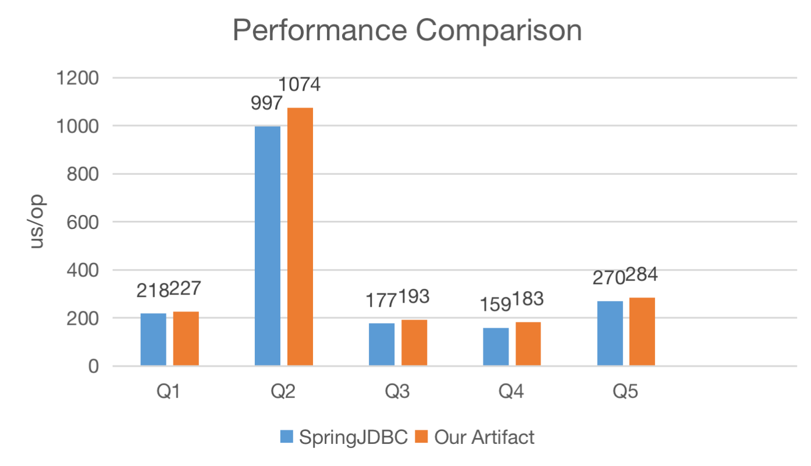

TPC-H Challenge - Minimum Code for 22 TPC-H Queries.
---

## Introduction

This repo shows how to execute the 22 TPC-H query statements.

Run [docker-compose.yml](docker-compose.yml) to start mysql container at port 3307.

Run [TpcHBenchmark](tpc-h-doyto-query%2Fsrc%2Ftest%2Fjava%2Fwin%2Fdoyto%2Ftpchchallenge%2Fbenchmark%2FTpcHBenchmark.java).main() to perform JMH benchmark testing.

The benchmark compares the performance between SpringJdbc and DoytoQuery.

Here is a performance comparison chart on MacBook Air M2 8GB/256GB:

<table>
    <tr>
        <td>Query SN</td>
        <td>View</td>
        <td>Query</td>
        <td>Having</td>
    </tr>
    <tr>
        <td>Q1</td>
        <td>1</td>
        <td>1</td>
        <td>0</td>
    </tr>
    <tr>
        <td>Q2</td>
        <td>1</td>
        <td>2</td>
        <td>0</td>
    </tr>
    <tr>
        <td>Q3</td>
        <td>1</td>
        <td>1</td>
        <td>0</td>
    </tr>
    <tr>
        <td>Q4</td>
        <td>1</td>
        <td>2</td>
        <td>0</td>
    </tr>
    <tr>
        <td>Q5</td>
        <td>1</td>
        <td>1</td>
        <td>0</td>
    </tr>
    <tr>
        <td>Q6</td>
        <td>1</td>
        <td>1</td>
        <td>0</td>
    </tr>
    <tr>
        <td>Q7</td>
        <td>2</td>
        <td>3</td>
        <td>0</td>
    </tr>
    <tr>
        <td>Q8</td>
        <td>2</td>
        <td>2</td>
        <td>0</td>
    </tr>
    <tr>
        <td>Q9</td>
        <td>2</td>
        <td>2</td>
        <td>0</td>
    </tr>
    <tr>
        <td>Q10</td>
        <td>1</td>
        <td>1</td>
        <td>0</td>
    </tr>
    <tr>
        <td>Q11</td>
        <td>1</td>
        <td>2</td>
        <td>1</td>
    </tr>
    <tr>
        <td>Q12</td>
        <td>1</td>
        <td>1</td>
        <td>0</td>
    </tr>
    <tr>
        <td>Q13</td>
        <td>2</td>
        <td>3</td>
        <td>0</td>
    </tr>
    <tr>
        <td>Q14</td>
        <td>1</td>
        <td>1</td>
        <td>0</td>
    </tr>
    <tr>
        <td>Q15</td>
        <td>2</td>
        <td>1</td>
        <td>0</td>
    </tr>
    <tr>
        <td>Q16</td>
        <td>1</td>
        <td>1</td>
        <td>0</td>
    </tr>
    <tr>
        <td>Q17</td>
        <td>1</td>
        <td>1</td>
        <td>0</td>
    </tr>
    <tr>
        <td>Q18</td>
        <td>1</td>
        <td>1</td>
        <td>1</td>
    </tr>
    <tr>
        <td>Q19</td>
        <td>1</td>
        <td>2</td>
        <td>0</td>
    </tr>
    <tr>
        <td>Q20</td>
        <td>1</td>
        <td>3</td>
        <td>0</td>
    </tr>
    <tr>
        <td>Q21</td>
        <td>1</td>
        <td>2</td>
        <td>0</td>
    </tr>
    <tr>
        <td>Q22</td>
        <td>2</td>
        <td>2</td>
        <td>0</td>
    </tr>
</table>
